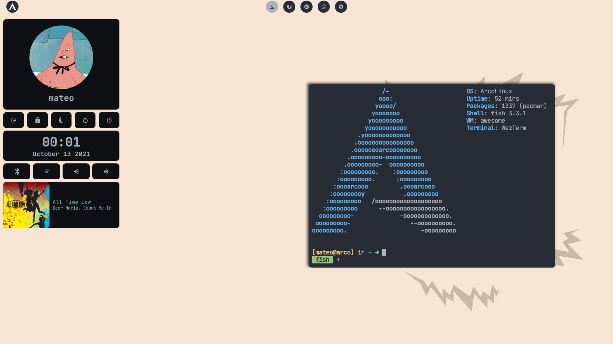
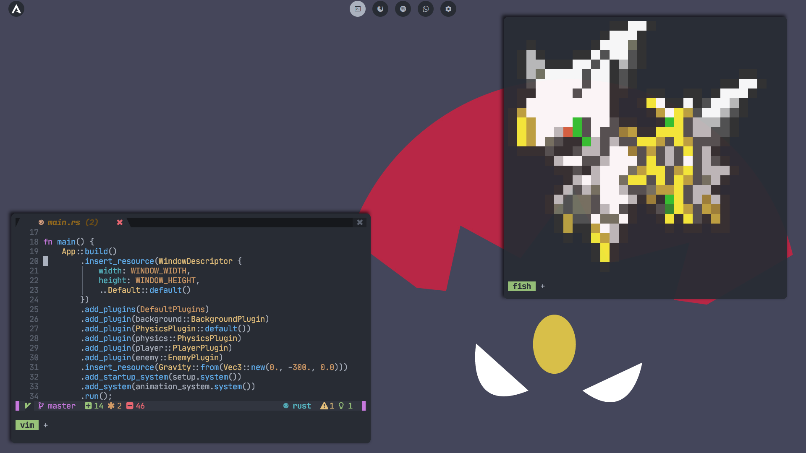

Dotfiles
======================================

These are all the config files I used for my main station. My current setup is:
- **OS:** ArcoLinux
- **WM:** awesome
- **Terminal:** Wezterm
- **Editor:** neovim
- **Launcher:** rofi
- **Compositor:** picom

Screenshots
======================================

